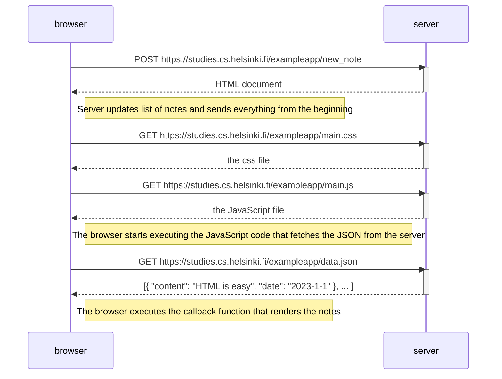
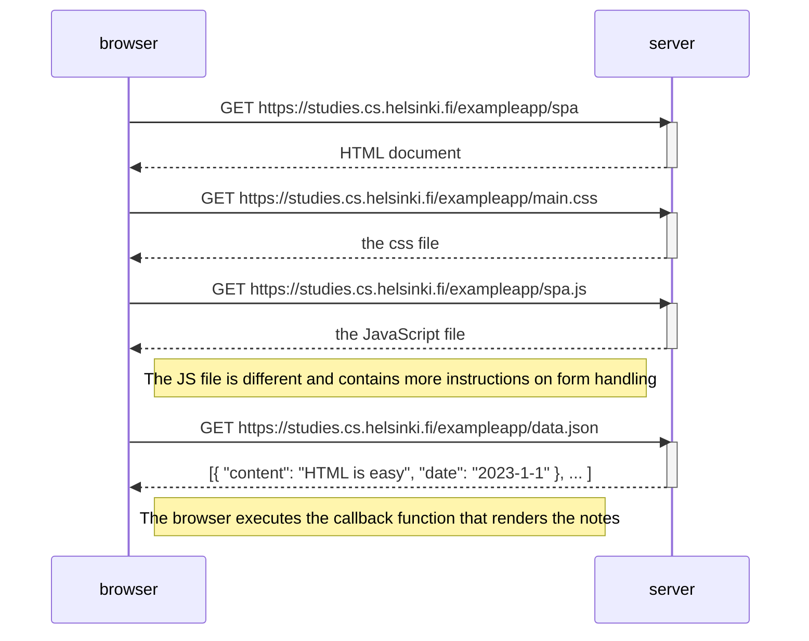
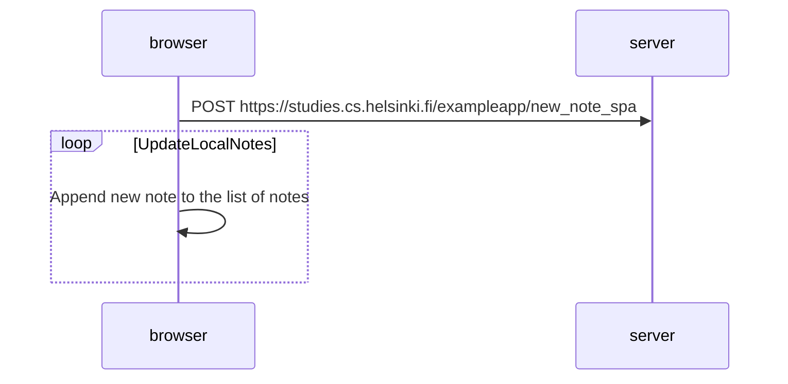

# Diagrams

## Exercise 0.4

## Exercise 0.5

The process of initial page loading for SPA is very similar to the classic web page,
the only difference is that it needs more JavaScript initially to have all the
notes handling logic.

## Exercise 0.6

In SPA we don't get anything back from server after the POST request. The notes are updated locally

